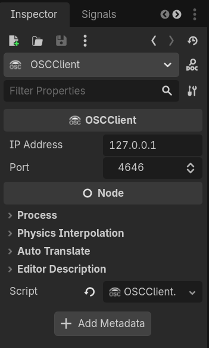
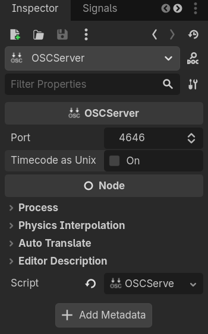
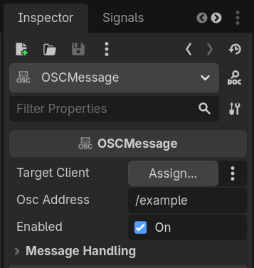
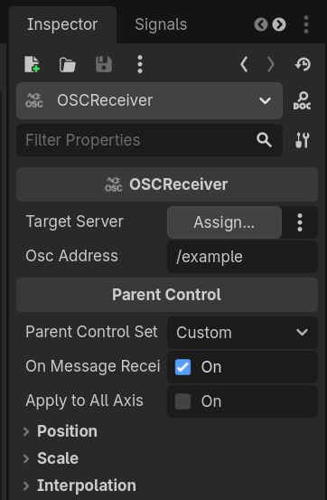
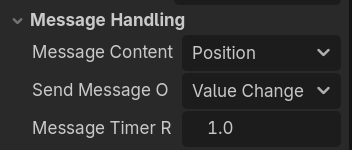
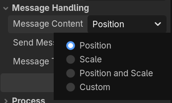
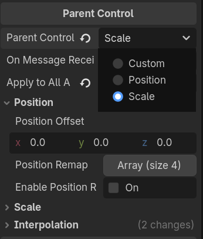
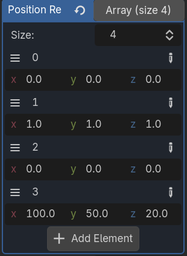

# What is GodOSC and OSC?

GodOSC is an Open Sound Control (OSC) library written in pure GDScript for the Godot game engine. OSC is a communication protocol for sending and receiving messages over a networked connection. This allows for extremely low-latency, reliable communication across applications and devices. 

GodOSC allows the Godot game engine to communicate with other applications that also support OSC such as Max/MSP, pure data, Touch Designer, MMMAudio, and Supercollider (among many others!). With GodOSC you can use Godot for audio visualizers, control surfaces for synths, or interactive audio/visual installations. 

OSC is an easy to use messaging format that uses *addresses* and *values*. An OSC address is formatted as a string with forward slashes. Here's an example of an OSC address that might be used with a synth:

```
"/synth/1/freq"
```

In this example the second part of the address determines the synth to send it to. If there was more than one synth, we could address the second synth by changing the address:

```
"/synth/2/freq"
```

OSC addresses are extremely flexible and the exact address itself is determined by the software that is receiving the OSC message. For instance, a different software may control the same value (frequency), using a different address:

```
"/synth/1/pitch"
```
Check your software's documentation to determine what the valid OSC addresses are.

These addresses are used to route incoming *values* to the software. Sticking with our synthesizer example, we might send a frequency value of 440hz (A4) to the frequency address above:

```
"/synth/1/freq" 440
```

GodOSC allows for the sending of the following data types over OSC:

* Booleans
* Floats
* Strings
* Integers
* Blobs 

# Using GodOSC

GodOSC uses a client/server architecture, where OSCClients send messages and OSCServers receive them. Typically, it is best to have one OSCServer per instance of Godot (either as an Autoload or in the scene itself) and one OSCClient per application you intend to *send* messages to. For instance, if we are sending and receiving messages from both Reaper and Max/MSP we would need one OSCServer node and two (2) OSCClient nodes.


You can use GodOSC in one of two ways:

* Interacting directly with OSCClient and OSCServer nodes in scripts.
* Using the OSCReceiver and OSCMessage nodes to format and route messages from an OSCClient or OSCServer.

OSCReceiver and OSCMessage handle some basic behavior for the user such as filtering out repeated values, matching OSC addresses, and default mappings for Control nodes such as HSlider. This allows the user to focus on *what* the OSC message does rather than *how* to make it do it.

<figure>
    </img>
    <figcaption>A typical project structure using GodOSC. Each target application is messaged using a unique OSCClient and all incoming messages are received using a single OSCServer.</figcaption>
</figure>

## Setting up an OSCClient and OSCReceiver

To get started with GodOSC you must first add at least one OSCClient node to send messages and one OSCServer node to receive messages. GodOSC uses UDP, a low-latency communication protocol, to send messages over the network. This requires us to know the *IP address* and *Port* of the target device for sending and defining a *Port* for receiving. By default, OSCClient sends messages to the *local* IP address (127.0.0.1) on port 4646. These settings can be changed in the inspector.

<figure>
    </img>
    <figcaption>The inspector showing the IP Address and Port properties for OSCClient with their default values.</figcaption>
</figure>

OSCServer requires only the *port* to be defined. By default OSCServer receives messages on port 4646. When OSCServer receives a message it will record the time that it received it. By default this will be in a human readable but imprecise format. For greater precision you can toggle the *Timecode as Unix" property.

<figure>
    </img>
    <figcaption>The inspector showing the Port and Timecode as Unix properties for OSCServer with their default values.</figcaption>
</figure>

Be careful when setting the port property for OSCServer. If any other application or service on your computer is already using the port you define to receive messages GodOSC will not work! For a list of common UDP ports see [this link](https://en.wikipedia.org/wiki/List_of_TCP_and_UDP_port_numbers).

## Using OSCMessage and OSCReceiver Nodes (Preferred)

OSCMessage and OSCReceiver are the preferred method for interacting with GodOSC. Both nodes work by communicating with an OSCClient (for OSCMessage) or OSCServer (for OSCReceiver) and then manipulating their *parent* node. Each node has a property for the target OSCClient/OSCServer that *must* be set for them to work. They also have a property for the *OSC address* to send/receive data to/from. Multiple OSCMessage or OSCReceiver nodes can send or receive from the *same* OSC address.


<figure>
    <div style="display:flex"></img>
    </img></div>
    <figcaption>The inspector for both OSCMessage and OSCReceiver.</figcaption>
</figure>

OSCMessage and OSCReceiver diverge after this though.

## OSCMessage

OSCMessage by default reads the properties of the parent node and formats an OSC message to be sent by an OSCClient. How and what the OSCMessage sends is found under the "Message Handling" group in the inspector:

<figure>
    </img>
    <figcaption>OSCMessage's Message Handling allows the user to define the data to be sent, when the data is sent, and how quickly to send data when in timer mode.</figcaption>
</figure>

The Message Handling group has three properties: Message Contents, Send Message On, and Message Timer Rate. Message Contents defines the *parent's property* that will be sent by the OSCMessage and allows for position, scale, position and scale, and custom contents. It will also send the *value* property for HSlider and VSlider if any option but "custom" is selected.

<figure>
    </img>
    <figcaptions>OSCMessage's message_contents properties allows for the sending of position, scale, position and scale, and custom configurations.</figcaption>
</figure>

Often we may want to send data that is not position or scale. The custom message contents is used for this purpose. This allows the user to extend the script for the OSCMessage and define their own message contents. The included script template for OSCMessage includes two functions: _custom_message_handling() and _custom_message_contents(). These allow for the definition of *when* to send messages (handling) and *what* to send (contents). If not using the custom handling OSCMessage will use the handling selected in the inspector.

```gdscript
## Code to be ran when Send Message On is set to custom
func _custom_message_handling():
	
	pass

## Code to be ran when Message Contents is set to custom. This must return a value
func _custom_message_contents() -> Variant:
	var value = 0
	
	return value
	pass
```

Custom message contents *must* return a value, and can either return a single valid data type (int, float, bool, string, blob) or an array of valid data types. This means that any data that is not an array must be converted to an array before being send. For instance, below is an example of sending the parent's *self_modulate* property using custom message contents:

```
func _custom_message_contents() -> Variant:
    var color = parent.self_modulate
	var value = [
        color.r,
        color.g,
        color.b,
        color.a
    ]
	
	return value
	pass
```

This allows for arbitrary message contents. Here's a more complex example where we send out the parent's name, position, and the number of children attached to the parent (minus the OSCMessage):

```
func _custom_message_contents() -> Variant:
    var children = parent.get_child_count() - 1
	var value = [
        parent.name,
        parent.position.x,
        parent.position.y,
        parent.position.z,
        children
    ]
	
	return value
	pass
```

## OSCReceiver

OSCReceiver receives data from an incoming OSC message and applies that data to its parent's *properties*. OSC Receiver can be assigned to a parent's scale, position, or a custom mapping. When in custom mode the on_message property can be set to false to allow for interpolation using lerp(), otherwise the values will be mapped instantly on the receipt of the OSC message. When in position or scale mode, the apply_to_all_axis property allows for a single value to be received and then applied uniformly on all position or scale axis. Otherwise, GodOSC expects the incoming OSC message to have the appropriate number of arguments for each axis (2 in 2d and 3 in 3d).

<figure>
    </img>
    <figcaption>The parent control category of OSCReceiver showing the different parent controls and the position group.</figcaption>
</figure>

The parent control section shows all of the options for controlling the node that the OSCReceiver is attached to. For both position and scale, there is an option to define both an offset for incoming data and to remap incoming data onto a new range. If mapping 2d scale or position data only the x and y components of the offset and remap are used. 

### Remapping

Remapping position or scale data uses an array of 4 vectors determining the minimum in, maximum in, minimum remap, and maximum remap. These remapping do not need to be uniform accross the entire vector. It is possible to take a uniform incoming vector and map into onto a vector with three different maximum values: 

<figure>
    </img>
    <figcaption>A non-uniform remapping of position values.</figcaption>
</figure>

It's also important to know that OSCReceiver sets the *global_position* of the parent node, not its *position* property.

